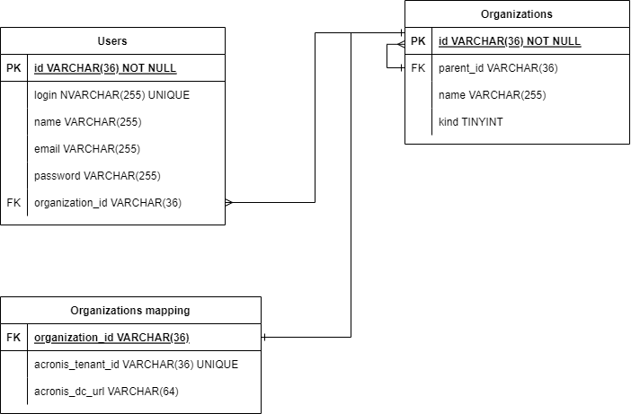

# CyberApp Sample Components

The repository provides a sample code for [Callback Handler](https://developer.acronis.com/doc/cyberapp/latest/guide/versions/callback-handler/index.html) and [Connector](https://developer.acronis.com/doc/cyberapp/latest/guide/versions/connector/index.html) that can be used by the CyberApps.

> **NOTE**: The code is provided for educational purposes only and is not intended for production usage.

## Requirements

* Python 3.6+
* `aiohttp`, `names` and `argon2-cffi` installed (provided in the requirements.txt)

## Overview

The sample code is written in Python and provides:

* An example of the database built with SQLite3.
* A web server that implements a callback handler with:
  * An implementation of predefined callbacks (application enablement, customer mapping).
  * An example of custom callbacks (reading users and creating a user).
* An example of the basic connector that posts new alerts and workloads to Acronis.

### About callback handler

With the callback handler, your service can receive callback requests from Acronis to allow the users to manage and interact with your CyberApp from Acronis UI.

The following diagram shows how Acronis communicates with the callback handler:


The main scenarios that the callback handler must implement are application enablement and customer mapping. They are required for the service providers to be able to configure your CyberApp and establish the correspondence between the end customers in your system and Acronis.

Additionally, the callback handler may support custom scenarios that would allow service providers and end customers to interact with your service.

For example, a user may open a main menu item in the Acronis UI that shows the information about the users in your service. The UI will send a corresponding callback that will ask for the list of users and show it in the UI as the result.

For more details on implementation, see the **Callback Handler** section below.

### About connector

With the connector, your service can send the requests to Acronis API to manage specific resources (such as your custom workloads and alerts) in the Acronis system.

The following diagram shows how the connector communicates with Acronis and its relationship to the callback handler:


For example, the connector may push the alerts from a particular organization in your service to the corresponding tenant in Acronis. Those alerts will be displayed in the Acronis UI in the Alerts section.

For more details on implementation, see the **Connector** section below.

## Database structure

The database includes 3 tables: `users`, `organizations` and `organizations_mapping`.

The following diagram demonstrates the tables and relationships:



### Tenancy model of the sample code

For demo purposes, the sample code matches the Acronis tenants hierarchy as closely as possible:

1. There are two kinds of organizations:
    * Partner - represents a service provider that provisions service to its end customers.
    * Customer - represents an end customer organization that purchases and consumes the services.
1. Partner organizations may have any number of nested partners.
1. Customers are not allowed to have nested organizations.

## Callback Handler

The callback handler uses the `aiohttp` HTTP server framework to accept the HTTP requests from Acronis and uses the database to manage:

1. Registered users and perform authentication.
1. Organizations available in the service.
1. Organizations mapped to Acronis tenants.

The code that implements the callback handler logic is located in the `./server/` folder.

### Routes

The routes for the HTTP server are defined in the `./server/routes.py` file. There are two routes defined:

* `GET /` - the web server index route. Can be used that the web server works.
* `POST /callback` - the callback route that accepts the callbacks.

The processing functions for the routes are defined in the `./server/handlers.py`.

### Access control

The code implements a simple access control system where the user is authenticated using a username and password.
The password is hashed using the Argon2 algorithm and stored in the database.

To authenticate callback requests from Acronis, the callback handler expects the credentials in the `X-CyberApp-Auth` header
in the following format: `<identity>:{"password": "<password>"}`. Where:

* `<identity>` - the value of the input field with type `Identity`.
* `<password>` - the value of the password field with type `Secret`. The password field ID must be `password`.

### Callbacks

The code for callbacks is located in the `./server/callbacks/` folder. The callbacks are grouped into Python modules
and merged in the `./server/callbacks/__init__.py` file that provides the callbacks mapping as a result.

#### Enablement callbacks

The callback handler implements enablement callbacks that are required to enable and manage your CyberApp successfully.

The sample code is located in `./server/callbacks/enablement.py`.

##### Application enablement

* `cti.a.p.acgw.callback.v1.0~a.p.enablement.read.v1.0` - Takes the user's `organization_id` and performs the lookup in the `organizations` mapping table. The payload includes the `organization_id` column value in the `vendor_tenant_id` field. If there's an entry found in the `organizations` mapping table, the `acronis_tenant_id` column value is included in the `acronis_tenant_id` field.
* `cti.a.p.acgw.callback.v1.0~a.p.enablement.write.v1.0` - Takes the data from the callback's payload and writes the information into the `organizations` mapping table.
* `cti.a.p.acgw.callback.v1.0~a.p.enablement.reset.v1.0` - Deletes all the entries related to the user's `organization_id` from the `organizations` mapping table.

##### Customer mapping

* `cti.a.p.acgw.callback.v1.0~a.p.topology.read.v1.0` - Takes the user's `organization_id` and, if the user's organization is mapped, lists all its customer organizations.
* `cti.a.p.acgw.callback.v1.0~a.p.tenant_mapping.read.v1.0` - Takes the user's `organization_id` and joins the `acronis_tenant_id` from the organizations mapping table for each mapped customer organization and lists the result.
* `cti.a.p.acgw.callback.v1.0~a.p.tenant_mapping.write.v1.0` - Takes the user's `organization_id`, verifies that provided organization IDs belong to that user, and writes the information into the `organizations` mapping table.

#### Custom callbacks

The callback handler implements the following custom callbacks:

* `cti.a.p.acgw.callback.v1.0~{APP_CODE}.users_read.v1.0` - Reads the list of users that are registered in the user's organization.
* `cti.a.p.acgw.callback.v1.0~{APP_CODE}.user_write.v1.0` - Creates a new user in the user's organization without a password. Note that login and email are unique and an attempt to add a user with already existing values will fail.

Where `{APP_CODE}` is the template variable that is substituted with the value specified in the `./constants.py`.

##### Read users callback

**Request**

Callback ID: `cti.a.p.acgw.callback.v1.0~{APP_CODE}.users_read.v1.0`

Callback request type: `cti.a.p.acgw.request.v1.0~{APP_CODE}.users_read.v1.0`

Callback request schema:

```json
{}
```

**Responses**

* Status code: `200`

  Response type: `cti.a.p.acgw.response.v1.0~{APP_CODE}.users_read_success.v1.0`

  Schema:

  ```json
  {
      "$schema": "http://json-schema.org/draft-04/schema",
      "type": "object",
      "properties": {
          "items": {
              "type": "array",
              "items": {
                  "type": "object",
                  "properties": {
                      "id": {
                          "type": "string"
                      },
                      "name": {
                          "type": "string"
                      },
                      "email": {
                          "type": "string"
                      }
                  },
                  "required": ["id", "name", "email"]
              }
          }
      }
  }
  ```

##### Write user callback

**Request**

Callback ID: `cti.a.p.acgw.callback.v1.0~{APP_CODE}.user_write.v1.0`

Callback request type: `cti.a.p.acgw.request.v1.0~{APP_CODE}.user_write.v1.0`

Callback request schema:

```json
{
    "$schema": "http://json-schema.org/draft-04/schema",
    "type": "object",
    "properties": {
        "login": {
            "type": "string"
        },
        "name": {
            "type": "string"
        },
        "email": {
            "type": "string"
        }
    },
    "required": ["login", "name", "email"]
}
```

**Responses**

* Status code: `200`
  
  Response type: `cti.a.p.acgw.response.v1.0~{APP_CODE}.user_write_success.v1.0`

  Schema:
  ```json
  {}
  ```

## Connector

The connector uses the `aiohttp` HTTP client framework to communicate with Acronis API and uses the database
to access the information about organizations that have mapped Acronis tenants.

The connector implements:

* API client authentication in Acronis cloud using OAuth 2.0 with the `client_credentials` flow.
* Sending information about the alerts using the Alert Manager API.
* Sending information about the workloads using the Workload Management API.

The sample code is located in the `./connector/` folder.

The code authenticates the API client and runs a basic loop where the API client pushes the alerts and workloads **to all mapped tenants** using Acronis API once in 30 minutes.

Note that the database does not store any actual alerts and workloads. The code implements a generator of random alerts and workloads to demonstrate the API requests. See `./connector/generator.py` and follow the instructions provided in this file to send your alerts and workloads.

## Postman collection

The code is bundled together with the Postman collection that can be used to send requests to the callback handler directly.

An online version of the collection is also available [here](https://www.postman.com/grey-rocket-585331/workspace/acronis-cyber-platform-s-public-workspace).

## Usage

### Before you start

1. Install the requirement with the following command:

   ```
   pip install -r requirements.txt
   ```

1. [During the first time run] Run the script to create a database:

   ```
   python ./create_db.py
   ```

   You will be prompted to enter the root username and password.

   The script will create an organization and sample sub-organizations that can be used for customer mapping.

   Additionally, sample users will be created in sample organizations and displayed in custom callbacks.

   By default, the script will write the resulting data to the `vendor.db` database file.

### Running the components

**To run the callback handler:**

Run the following command:

```
python ./run_server.py 
```

This will run HTTP server on port 8080 and connect to `vendor.db` database file by default.

You can also specify SSL certificates to enable HTTPS:

```
python ./run_server.py --certfile <absolute_path_to_cert> --certkey <absolute_path_to_key>
```

This will run HTTPS server on port 443 and connect to `vendor.db` database file by default.

**To run the connector:**

1.  Rename `connector.example.json` to `connector.json`.

1.  Open `connector.json` and specify the client credentials in the corresponding fields.

1.  Run the following command:

    ```
    python ./run_connector.py
    ```

This will connect to `vendor.db` database file by default.
